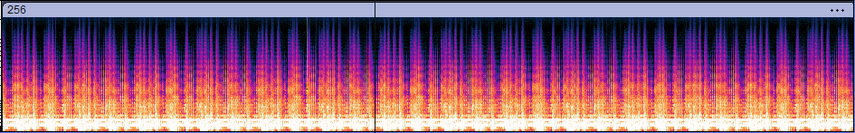

# Is there an Echo?


> *Maybe next time you should record your music in an acoustically treated space.*


The challenge gives us a single audio file called `256.wav`, which we can listen to here:

<audio controls>
  <source src="256.wav" type="audio/wav">
  Your browser does not support the audio element.
</audio>

A couple of initial observations: the audio seems to loop, and the audio seems to have some stutters in it. First thing we always do, we put it into audacity, and inspect the spectrogram for hidden messages:



No dice. It seems that we need to do something else to recover the image here.

## Understanding the challenge

One thing we could do is try to understand what the title means. 
> **Is there an echo?**

Furthermore, running `strings` on the wave file, gives us a curious clue: `cepstral domain single echo`:


Reading a bit more into how echos relate to audio stego challenges, we come across something interesting: the concept of *echo hiding*, discussed in the following paper from springer:
https://link.springer.com/content/pdf/10.1007/3-540-61996-8_48

> *Echo hiding introduces changes to the cover audio that are characteristic of environmental conditions rather than random noise, thus it is robust in light of many lossy data compression algorithms.*

in summary, the idea behind Echo hiding is to encode information by manipulating certain characteristics of echoes, like delay time, amplitude, or phase, in a way that doesn't significantly degrade the quality of the original audio. The four main echo parameters are:
- the beginning amplitude 
- the decay rate 
- the "zero" offset 
- the "one" offset

We can see these parameters in a spectral analysis of the mixed audio file:


The first step in mixing is selecting the delay time for the echo. The delay is the time interval between the original signal and the beginning of the echo. To prevent the echo from being detected as a separate sound, this delay is normally quite small (between 0.1 and 1 milliseconds).The audio signal is then divided into multiple windows or segments, which will determine where the echo will be applied. This process prevents the echo from being continuous across the entire file and allows for more precise control over where data is embedded. 


The echo is then blended with the original audio signal. This is done by adding the echo to the original signal waveform at the chosen delay. The mixed signal is typically expressed as:

$$W' = W + \alpha \times E$$ 
where $W'$ is the newly mixed wave equation, $\alpha$ is an amplitude factor to determine the strength of the echo, and $E$ is the introduced echo. 

A simple FIR Filter equation is used to delay the audio signal and then mix in the echo with the original signal. In the frequency domain, this would be
$$H(z) = 1 + gz^{-d}$$
- The $z^{-d}$ term represents a delay by $d$ samples, which is applied to delay the actual echo
- the $g$ term represents the gain or scaling factor applied to the delayed signal. 


Two such filters are there for the zero and one kernels, which then are combined to form the data encoded signal. 


In summary, the audio is divided into windows, the delays are applied, the echoes are blended in with appropriate scaling, and two FIR filters allow binary data to be encoded efficiently into the audio signal without significant loss of quality or perceptibility.

## Decoding the audio

The easiest step to do is to analyze where the delays are. To do this, we analyze the **"cepstrum"** of the audio file. The **cepstrum** analysis is a way to basically seperate the echoes from the original signal. Echoes are located at regular intervals based on bit offsets. As a result, we know that the echoes will occur in one of two locations, with a slight periodicity across each window to which it was applied.


We can do this analysis automatically on audacity!!! Going to the spectrogram window and performing the Cepstrum algorithm on the file reveals 2 isolated and suspicious looking peaks:


Using a hanning windowing function isolates the area around the peaks a little further. Here, we can clearly see that the first peak occurs at almost exactly 0.0010s, while the second one occurs a little bit before 0.0012s. To find the actual offsets from the original signal in terms of sampling, we should find out what the sampling rate of the signal is. Luckily, we can find it just from the original image. The first peak in this spectrogram correlates to the fundamental frequency of the function. In exported cepstrum textfile, we can see that this sampling rate is 48kHz:


So that means that every second, 48000 samples were taken. This means that the first "zero" offset is $0.0010s \times 48000 \ \text{samples per second}$, or 48 samples, and rounding down from $0.0012s \times 48000 \ \text{samples per second}$ gives us the "one" offset to be $57$ (we rounded down as the delay occured before 0.0012s).

Now to extend this to multiple bit messages, stego audio is divided into segments as the number of hidden bits with the same segment length as has been used during encoding. Then to retrieve the $n$-th hidden bit, the real cepstrum of the $n$-th segment, which is given in the equation labeled $(E)$, is compared on delay points. If 


$$c_n[d_0 + 1] > c_n[d_1 + 1]$$

then the retrieved bit is zero, else it is one.


$$(E) \ \ \ \ c_n[i] = \text{ifft} \left( \log \left( \text{abs} \left( \text{fft} \left( s_n[i] \right) \right) \right) \right)$$

Adapting code from [this repo](https://github.com/ctralie/EchoHiding/blob/b74a9b3a749ee7ebed71ed6c1c5de478560dcd0e/echohiding.py), we can formalize this formula to extract the bits using the echo offsets `delta0, delta1` and window size `L`: 

```py
import numpy as np

hann = lambda win: 0.5*(1-np.cos(2*np.pi*np.arange(win)/win))

def extract_echo_bits(y, L, delta0=48, delta1=57):
    #pad the signal to calculate the number of windows at each segment
    yp = np.pad(y, (L//2, L//2))
    T = (yp.size-L*2)//L+1
    n_even = yp.size//(L*2)
    n_odd = T-n_even
    Y = np.zeros((T, L*2))
    #Y holds the segmented signal, with T windows of size L*2
    Y[0::2, :] = np.reshape(yp[0:n_even*L*2], (n_even, L*2))
    Y[1::2, :] = np.reshape(yp[L:L+n_odd*L*2], (n_odd, L*2))

    #The hann window allows us to perform more precise frequency analysis when doing FFTs
    Y = Y*hann(L*2)[None, :]
    F = np.abs(np.fft.rfft(Y, axis=1))
    F = np.fft.irfft(np.log(F+1e-8), axis=1)
    return np.array(F[:, delta1] > F[:, delta0], dtype=int)
```
The one unknown so far in all of this would be the window segment size, $L$. It would depend on how big the flag is. But based on the `256.wav` file, a good first guess we had was 256 bits, or 32 characters, which would be a valid flag length. 

Starting off at an arbitrary $L = 8 \times 1024$ (based on implementations and tests of this I found online), the message size was way off:


However what if I instead decide to use $L = 8 \times 2048$, or roughly double the window size:


The answer lies in `T = (yp.size - L*2) // L + 1`, where `T` is the number of windows that can fit into the full signal (plus padding). When you double the window size, you essentially halve the number of segments that can fit into the same audio signal. As a result, fewer windows are processed, and consequently, fewer bits are extracted. So for each window, we extract a bit (0 or 1) based on the echo. 

So based on this pattern we observed, we can brute force offsets added $L = 8 \cdot 2048$ to see when we hit a total of 256 bits extracted.


Now our solve script is:

```py
import numpy as np
from scipy.io import wavfile
import re

hann = lambda win: 0.5*(1-np.cos(2*np.pi*np.arange(win)/win))

def extract_echo_bits(y, L, delta0=50, delta1=57):
    yp = np.pad(y, (L//2, L//2))
    T = (yp.size-L*2)//L+1
    n_even = yp.size//(L*2)
    n_odd = T-n_even
    Y = np.zeros((T, L*2))
    Y[0::2, :] = np.reshape(yp[0:n_even*L*2], (n_even, L*2))
    Y[1::2, :] = np.reshape(yp[L:L+n_odd*L*2], (n_odd, L*2))
    Y = Y*hann(L*2)[None, :]
    F = np.abs(np.fft.rfft(Y, axis=1))
    F = np.fft.irfft(np.log(F+1e-8), axis=1)
    return np.array(F[:, delta1] > F[:, delta0], dtype=int)

get_msg = lambda s: ''.join(chr(int(s[i*8:i*8+8], 2)) for i in range(len(s)//8))

def is_valid_message(msg):
    return re.fullmatch(r'[0-9a-zA-Z]+', msg) is not None

sample_rate, audio_data = wavfile.read('256.wav')

if audio_data.dtype == np.int16:
    audio_data = audio_data / 32768.0
elif audio_data.dtype == np.int32:
    audio_data = audio_data / 2147483648.0

delta0 = 48
delta1 = 57

for i in range(2049):  
    L = 8*2048 + i
    extracted_bits = extract_echo_bits(audio_data, L, delta0, delta1)
    binstr = ''.join(str(bit) for bit in extracted_bits)
    if len(binstr) == 256:  
        bit_groups = [extracted_bits[i:i+8] for i in range(0, len(extracted_bits), 8)]
        bit_strings = [''.join(str(bit) for bit in group) for group in bit_groups]
        decoded = get_msg(binstr)
        
        print(f"L: {L}, Delta0: {delta0}, Delta1: {delta1}")

        if "csawctf{" in decoded:
            print(f"Found possible flag: {decoded}")
```


Lo and behold, we found our flag: `csawctf{1nv3st_1n_s0qndpr00f1ng}`
